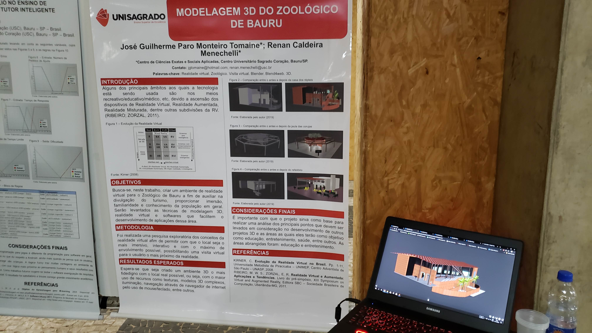
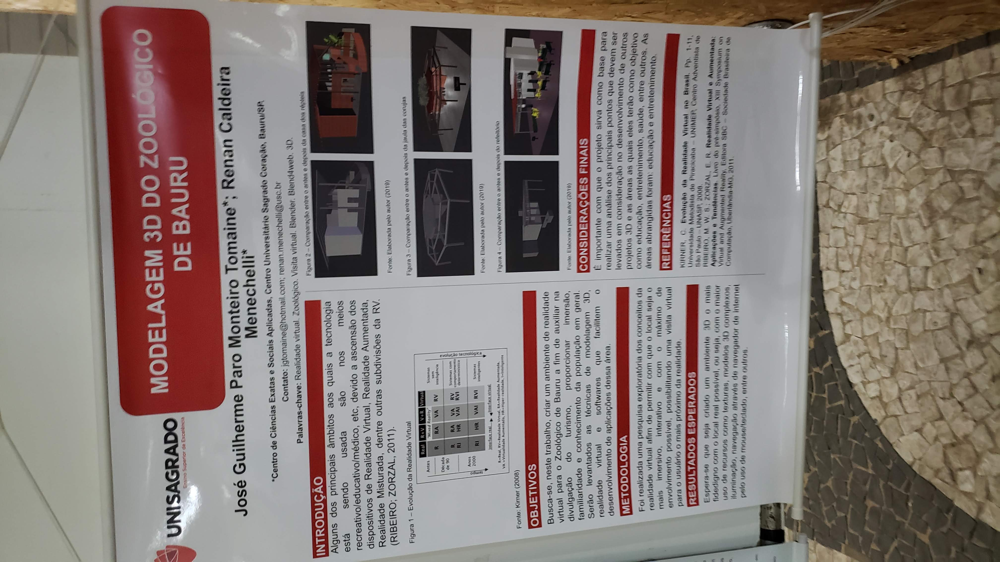
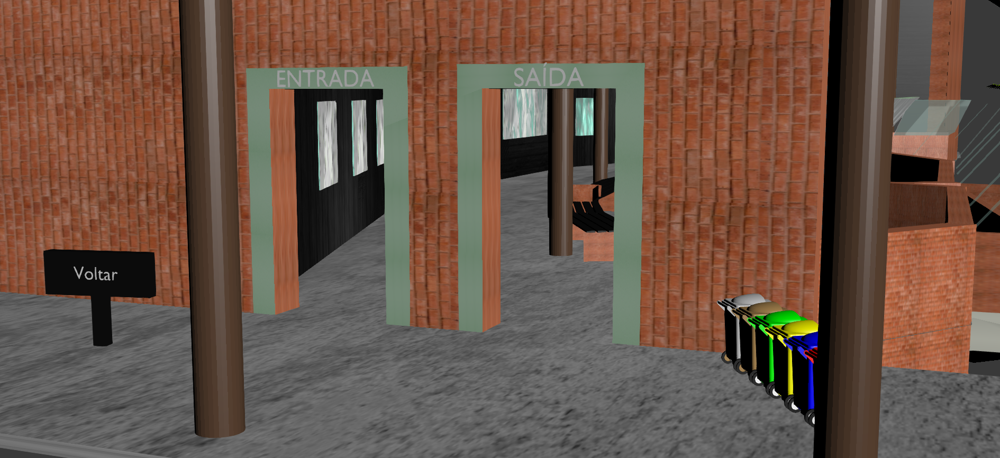
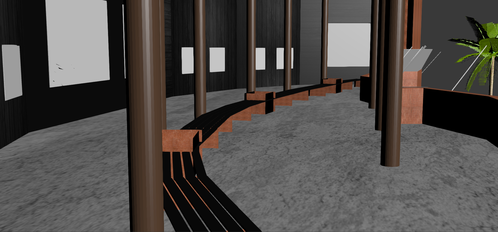
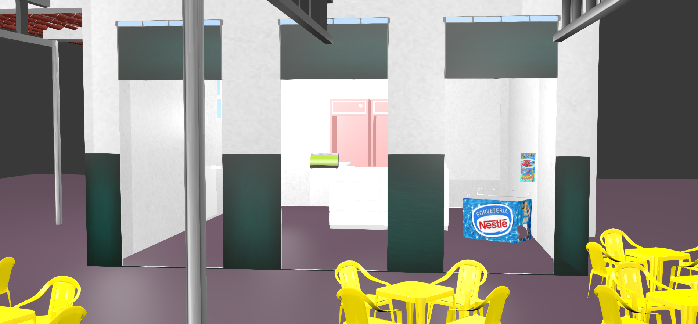
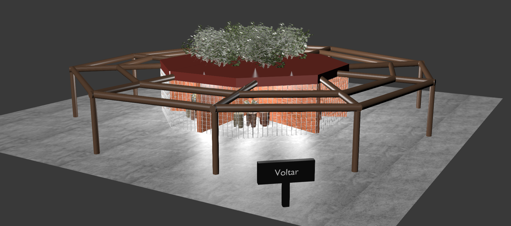
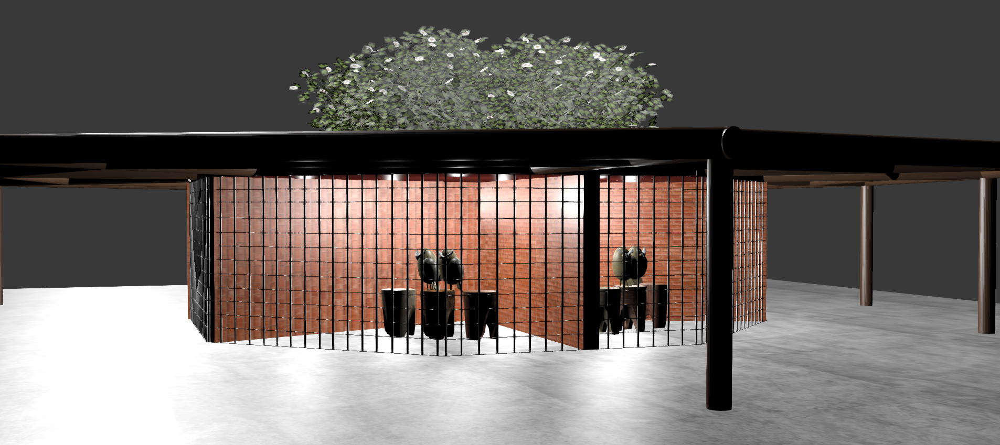

    

<h1 align="center">
    Completion of Course Work - 3D Modeling of the Bauru Zoo
</h1>

    <h4>
        <a href="https://unisagrado.edu.br/">Centro Universitário Sagrado Coração - Bauru / SP - Brazil</a>
    </h4>

    <a href="README.md">Português</a>
    ·
    <a href="README-en.md">English</a>

 

    
    

## 📁 Written work
- [PDF](https://github.com/zehguilherme/tcc-rv-zoo-bauru/blob/master/JOS%C3%89_GUILHERME_PARO_MONTEIRO_TOMAINE_860582.pdf)

## 📌 About the zoo

On August 24, 1980, our Municipal Zoological Park was inaugurated, which over the years has become one of the main institutions of its kind in our country and the main tourist attraction in Bauru and the Region. Today, with about 700 animals of more than 170 different species, including mammals, reptile birds and fish, it receives around 300,000 visitors per year.

Find out more at the zoo's [website](http://zoobauru.com.br/)

## 🚀 Technologies

- [Blender](https://www.blender.org/) - 3D Modelling
- [Blend4web](https://www.blend4web.com/en/) - Framework for displaying 3D models on the web
- [HTML](https://developer.mozilla.org/pt-BR/docs/Web/HTML) - Language to which all 3D models (.blend) were converted

## ✍ Use

- Go to the `web` folder in `blender / web` and open the file `Zoológico.html` (Main file).

- The entire initial "model" of the site will be shown on the screen, and when zooming in, it will be possible to check the existence of several signs, in which when clicking on each of them, the user will be redirected to the indicated cage / location.

- Being in the new location he can explore it and when he wants to go back to the main file, just click on the `Back` sign.

## 💻 Project presentation

## 📍 Some locations present

<h3 align="center">
   🐍 Reptile enclosure
</h3>

---

<h3 align="center">
   🍔 Refectory
</h3>

---

<h3 align="center">
🦉 Enclosure of Owls
</h3>

---

<h3 align="center">
   🐵 Monkey enclosure
</h3>

---

<h3 align="center">
   🐧 Penguin Enclosure
</h3>

## 🤔 Contributing

1. Fork the project.
2. Create your feature branch (`git checkout -b my-new-feature`)
3. Commit your changes (`git commit -am 'Add some feature'`)
4. Push to the branch (`git push origin my-new-feature`)
5. Create a new Pull Request
6. After the merge of your pull request is done, you can delete your branch.

## 📝 License

This project is under the MIT license. See the [license](LICENSE) for more information.

---

Made with 💟 by José Guilherme Paro Monteiro Tomaine 👋 [Talk to me!](https://www.linkedin.com/in/jos%C3%A9-guilherme-paro-monteiro-tomaine/)
