

    

<h1 align="center">
    TCC - Modelagem 3D do Zoológico de Bauru
</h1>

    <h4>
        <a target="_blank" href="https://unisagrado.edu.br/">Centro Universitário Sagrado Coração - Bauru / SP</a>
    </h4>

    <a href="README.md">Português</a>
    ·
    <a href="README-en.md">English</a>

 

    
    

## 📁 Arquivo do TCC
- [TCC (PDF)](https://github.com/zehguilherme/tcc-rv-zoo-bauru/blob/master/JOS%C3%89_GUILHERME_PARO_MONTEIRO_TOMAINE_860582.pdf)

## 📌 Sobre o zoológico

Em 24 de agosto de 1.980 era inaugurado o nosso Parque Zoológico Municipal, que veio a se transformar através dos anos em uma das principais instituições do gênero em nosso País e a principal atração turística em Bauru e Região. Hoje com cerca de 700 animais de mais de 170 espécies diferentes entre mamíferos, aves répteis e peixes, recebe por ano cerca de 300.000 visitantes.

Saiba mais no [site](http://zoobauru.com.br/) do próprio zoológico.

## 🚀 Tecnologias

- [Blender](https://www.blender.org/) - Modelador 3D
- [Blend4web](https://www.blend4web.com/en/) - Framework para exibição dos modelos 3D na web
- [HTML](https://developer.mozilla.org/pt-BR/docs/Web/HTML) - Linguagem ao qual foram convertidos todos os modelos 3D (.blend)

## ✍ Utilização

- Vá até a pasta `web` em `blender/web` e abra o arquivo `Zoológico.html` (Arquivo principal).

- Será mostrado em tela toda a "maquete" inicial do local, e ao dar zoom poderá ser verificado a existência de várias placas, em que ao clicar sobre cada uma delas, o usuário será redirecionado para a jaula/local indicado.

- Estando no novo local ele pode explorá-lo e ao desejar voltar para o arquivo principal, basta clicar na placa `Voltar`.

## 💻 Apresentação do projeto

## 📍 Alguns locais presentes

<h3 align="center">
   🐍 Recinto dos Répteis
</h3>

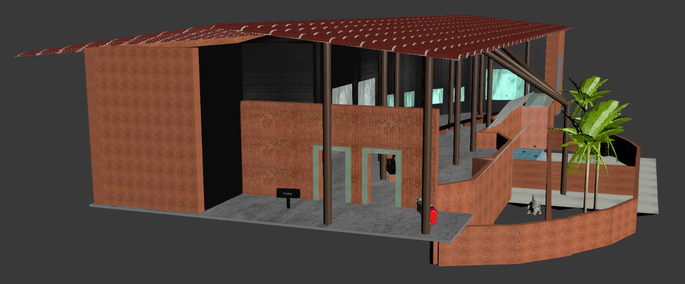

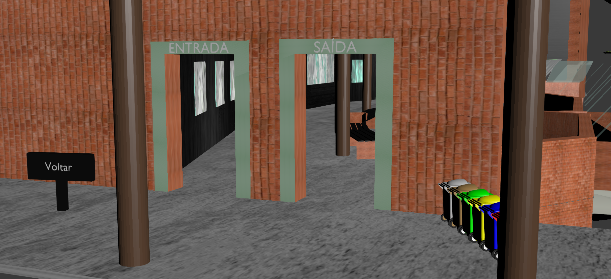

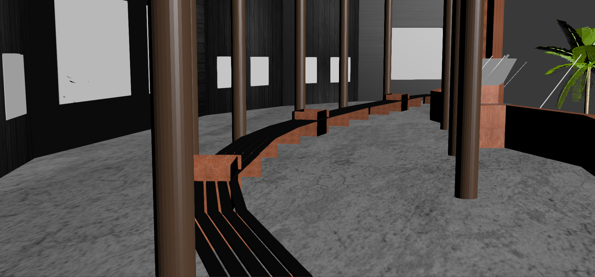

---

<h3 align="center">
   🍔 Refeitório
</h3>

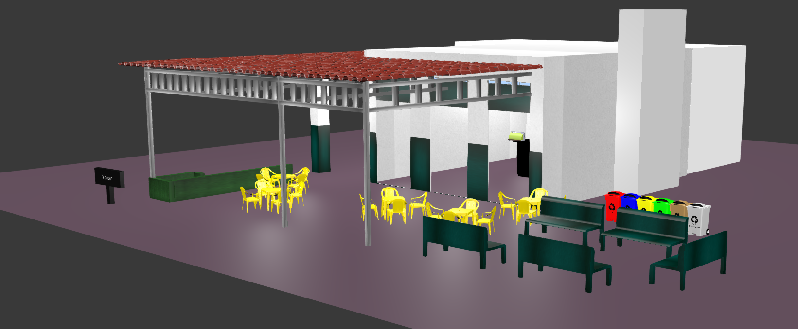

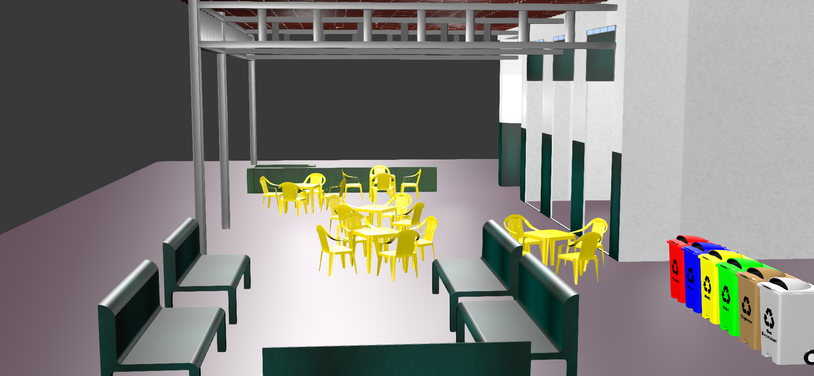

---

<h3 align="center">
🦉 Recinto das Corujas
</h3>

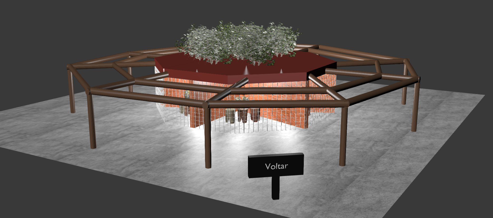

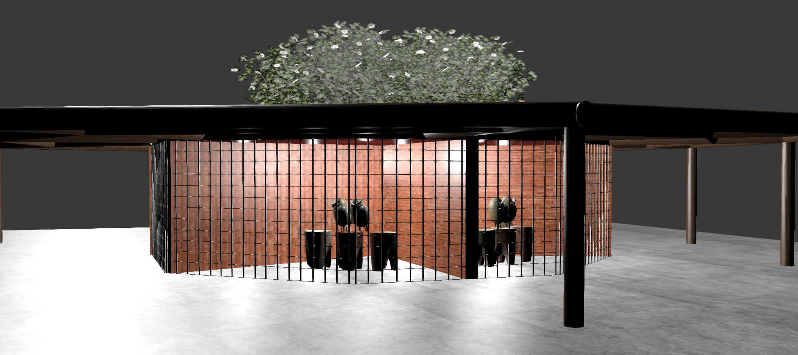

---

<h3 align="center">
   🐵 Recinto dos Macacos
</h3>

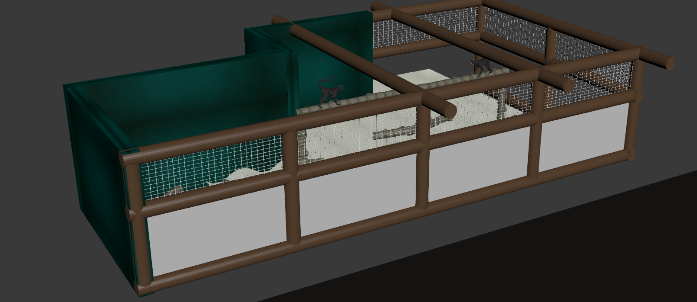

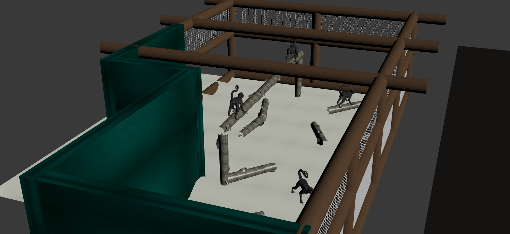

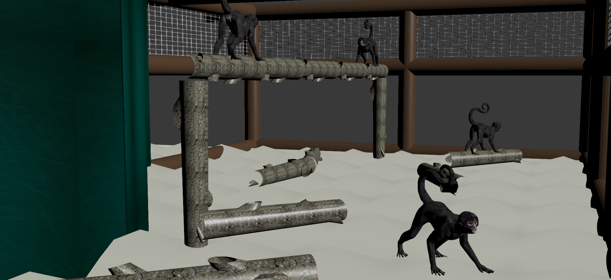

---

<h3 align="center">
   🐧 Recinto dos Pinguins
</h3>

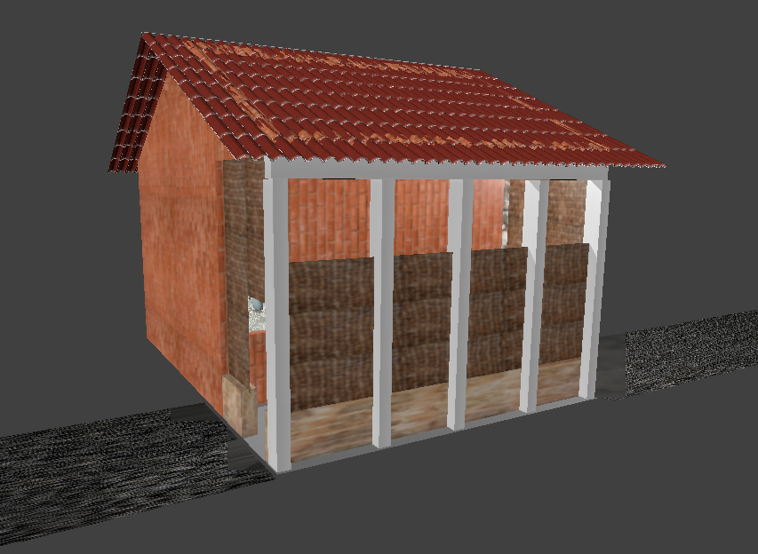

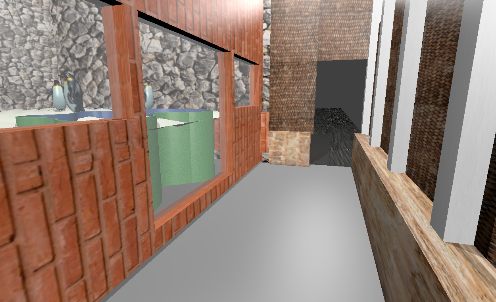

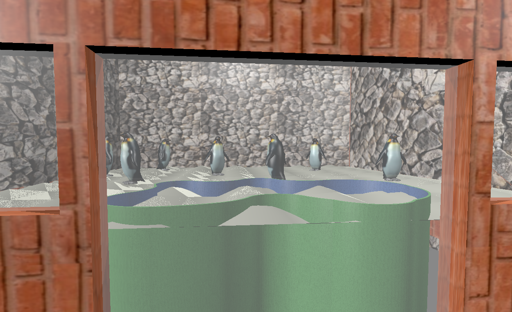

## 🤔 Como contribuir

1. Faça um fork desse repositório;
2. Crie uma branch com a sua feature: `git checkout -b minha-feature`;
3. Faça commit das suas alterações: `git commit -m 'feat: Minha nova feature'`;
4. Faça push para a sua branch: `git push origin minha-feature`;
5. Crie um pull request;
6. Depois que o merge da sua pull request for feito, você pode deletar a sua branch.

## 📝 Licensa

Este projeto está sob a licensa MIT. Veja a [licensa](LICENSE) para mais informações.

---

Feito com 💟 por José Guilherme Paro Monteiro Tomaine 👋 [Fale comigo!](https://www.linkedin.com/in/jos%C3%A9-guilherme-paro-monteiro-tomaine/)
